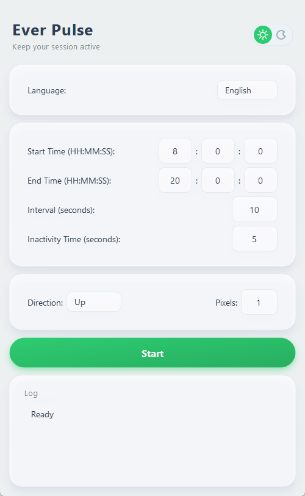

# Ever Pulse

[中文文档](README_cn.md)

**v2.0**

A modernized, premium utility designed to keep your Windows session active. Rebuilt with **PySide6** and "Ever Pulse" tech-navy aesthetics.



*(Note: v2.2 UI updated with Ever Pulse branding)*

## ✨ Features

- **Premium UI**: "Ever Pulse" tech-navy design with Glassmorphism, real-time Dark/Light mode, and smooth animations.
- **Integrated Logging**: Activity logs now presented in a cohesive glassmorphic card.
- **Window Memory**: Automatically remembers and restores window position from previous session.
- **Bilingual Support**: Instant switching between **English** and **Chinese**.
- **Portable & Persistent**: Single EXE file, saves settings to `config/config.ini`.
- **Single Instance**: Robust single-instance support—launching again wakes up the existing window.
- **High Stability**: Robust RGB rendering prevents black screens and glitches.

## 🏗️ Architecture

Ever Pulse follows a modular **separation of concerns** design to ensure maintainability and high performance:

- **Core Engine**: Encapsulates automation logic, configuration management, and localized i18n support.
- **Worker Threading**: Utilizes `QThread` to handle background mouse monitoring and movement, ensuring a lag-free UI experience.
- **Glassmorphic UI Layer**: A modern interface built with PySide6, featuring custom styled widgets with real-time ARGB rendering and shadow effects.

## 📂 Project Structure

```text
ever_pulse/
├── assets/             # Static resources (Icons, v2.2 localized strings)
├── config/             # User specific configurations (Auto-generated)
├── core/               # Backend logic (Automation, ConfigMgr, I18n)
├── ui/                 # Frontend components (Themes, Crystal Widgets, Main Window)
├── main.py             # Application entry point
└── main.spec           # PyInstaller build specification
```

## 🛠️ Development & Setup

### 1. Download & Run
Download the latest compiled version from the [Releases](https://github.com/julianhopkingson/ever_pulse/releases) page. Just double-click `ever_pulse.exe` to start.
*(Note: If you are upgrading, make sure to close the current app using `taskkill /F /IM ever_pulse.exe`)*

### 2. Build from Source
If you want to modify the code or build your own version:

```bash
# Clone the repository
git clone https://github.com/julianhopkingson/ever_pulse.git
cd ever_pulse

# Install dependencies
pip install -r requirements.txt

# Run in development mode
python main.py

# Build executable (Single EXE)
pyinstaller main.spec --clean --noconfirm
```

## ⚙️ Configuration

> **Note**: The configuration file is automatically generated at `config/config.ini` upon first run.

- **Interval**: How often the mouse moves (in seconds).
- **Idle Time**: How long you must be inactive before the tool starts moving the mouse.
- **Direction & Pixels**: Customize the movement direction and distance.

## 📄 License

This project is licensed under the MIT License - see the [LICENSE](LICENSE) file for details.
