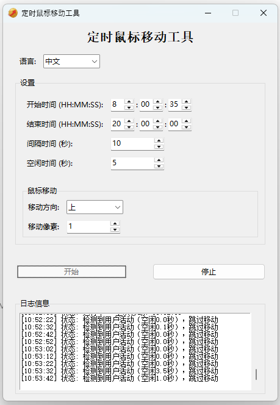

# Mouse Mover

[中文文档](README_zh.md)

A lightweight, Python-based utility designed to prevent your Windows computer from going to sleep or locking the screen by simulating micro mouse movements.



## Features

- **Prevent Sleep/Lock**: Keeps your status "Online" on Teams, Slack, etc.
- **Smart Idle Detection**: Only moves the mouse when you are idle. If you move the mouse or use the keyboard, it detects activity and pauses automatically.
- **Scheduled Operation**: Set specific Start and End times. The tool will automatically start working and stop working at your defined hours.
- **Invisible "Jiggle"**: The mouse moves slightly and immediately returns to the original position, making the movement practically invisible to the user.
- **Multi-language Support**: Native support for **English** and **Chinese**.
- **No External Dependencies**: Built with standard Python libraries (`tkinter`, `ctypes`), so no heavy `pip install` required.

## Usage

1.  Ensure you have Python installed.
2.  Run the script:
    ```bash
    python mouse_mover.py
    ```
3.  Set your desired **Start Time** and **End Time**.
4.  Click **Start**.

## Configuration

> **Note**: The configuration file is automatically generated at `config/config.ini`.

- **Interval**: How often the mouse moves (in seconds).
- **Idle Time**: How long you must be inactive before the tool starts moving the mouse.
- **Direction & Pixels**: Customize the movement direction and distance.

## License

This project is open source.
