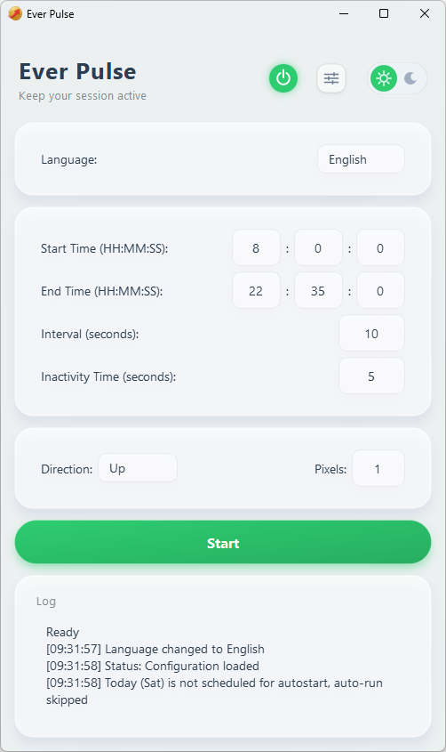

# Ever Pulse

[中文文档](README_cn.md)

**v2.3**

A modernized, premium utility designed to keep your Windows session active. Rebuilt with **PySide6** and "Ever Pulse" tech-navy aesthetics.



## ✨ Features

- **Premium UI**: "Ever Pulse" tech-navy design with Glassmorphism, real-time Dark/Light mode, and smooth animations.
- **Autostart & Scheduling**: Native startup toggle with zero-click run, plus 7-day schedule filtering (auto-exits quietly on off days).
- **Smart Idle Detection**: Engages only when you are away (inactivity exceeds threshold) to avoid disturbing your workflow.
- **Precision Scheduling**: Supports start/end times with second alignment, handling both daily work hours and overnight sessions.
- **Motion Customization**: Configurable movement directions (`Up`, `Down`, `Left`, `Right`) and customizable pixel steps.
- **Bilingual & Memory**: Seamless switching between **English** and **Chinese**, automatically saving and restoring window position.
- **Portable & Single Instance**: Single EXE file, saves settings to `config/config.ini`, wakes existing window if launched again.

## 🏗️ Architecture

Ever Pulse follows a modular **separation of concerns** design to ensure maintainability and high performance:

- **Core Engine**: Encapsulates automation logic, configuration management, autostart scheduling, and localized i18n support.
- **Worker Threading**: Utilizes `QThread` to monitor inactivity and simulate input smoothly without blocking the UI.
- **Glassmorphic UI Layer**: A modern interface built with PySide6, featuring custom styled widgets with real-time ARGB rendering and vector icons.

## 📂 Project Structure

```text
ever_pulse/
├── assets/             # Static resources (Icons, language dictionaries, UI previews)
├── config/             # User configurations (Auto-generated config.ini)
├── core/               # Backend logic (Automation, Schedule Mgr, ConfigMgr, I18n)
├── docs/               # Architecture design & specification documents
├── tests/              # Unit test suite
├── ui/                 # Frontend components (Themes, Crystal Widgets, Main Window, Dialogs)
├── main.py             # Application entry point with CWD locking & startup guard
└── main.spec           # PyInstaller build specification
```

## 🛠️ Development & Setup

### 1. Download & Run
Download the latest compiled version from the [Releases](https://github.com/julianhopkingson/ever_pulse/releases) page. Just double-click `ever_pulse.exe` to start.  
*(Note: If you are upgrading, make sure to close the current app using `taskkill /F /IM ever_pulse.exe`)*

### 2. Build from Source
If you want to modify the code or build your own version:

```bash
# Clone the repository
git clone https://github.com/julianhopkingson/ever_pulse.git
cd ever_pulse

# Install dependencies
pip install -r requirements.txt

# Run in development mode
python main.py

# Run unit tests
python -m unittest discover tests

# Build executable (Single EXE)
pyinstaller main.spec --clean --noconfirm
```

## ⚙️ Configuration

> **Note**: The configuration file is automatically generated at `config/config.ini` upon first run.

- **autostart**: `True` / `False` for Windows startup registry integration.
- **autostart_days**: Active days index (e.g., `1,2,3,4,5` for Mon-Fri, default).
- **interval**: How often the mouse moves (in seconds).
- **activity_threshold**: Inactivity duration before simulated movement begins (in seconds).
- **direction & pixels**: Customize movement direction (`Up`, `Down`, `Left`, `Right`) and distance.
- **auto_close_enabled**: Optional auto-shutdown upon reaching end time.

## 📄 License

This project is licensed under the MIT License - see the [LICENSE](LICENSE) file for details.
