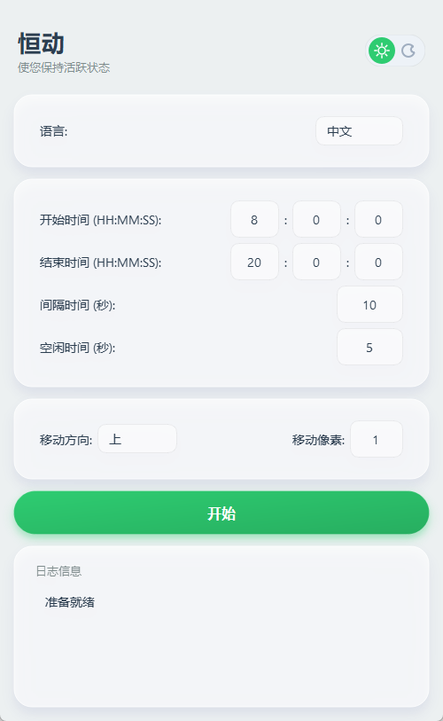

# 恒动 (Ever Pulse)


一款现代化、高颜值的 Windows 效率工具，防止电脑进入锁屏或休眠状态。采用 **PySide6** 重构，深度打磨海军蓝极客视觉体验。



## ✨ 功能特点

- **极致 UI**: "Ever Pulse" 深海蓝极客设计，支持日/夜间模式切换与全卡片化布局。
- **智能空闲检测**: 仅在您离开电脑时（空闲超过阈值）自动介入。
- **精准对齐**: 首次运行自动对齐至指定秒数，确保每分钟整点执行。
- **定时运行**: 支持设置上下班时间，开启自动守护。
- **智能调度**: 
    - **单日模式**: 到点严格停止，防止超时运行。
    - **跨天模式**: 支持通宵挂机。
- **位置记忆**: 自动记住并恢复上次关闭时的窗口位置。
- **双语支持**: 内置 **中文** 和 **English**，界面一键切换。
- **规范化配置**: 单个 EXE 便携运行，设置自动保存至 `config/config.ini`。
- **单实例运行**: 支持单实例互斥，重复运行将自动唤醒已有窗口。
- **高稳定性**: 彻底解决黑屏与闪退问题，支持高 DPI 缩放。

## 🏗️ 技术架构

**Ever Pulse** 采用模块化解耦设计，确保工具的极简与高效：

- **核心引擎 (Core)**: 独立封装自动化逻辑、配置管理及多语言 (i18n) 支持。
- **异步驱动 (Worker)**: 基于 `QThread` 的异步线程机制，在不阻塞主界面的情况下精准监控空闲状态。
- **毛玻璃 UI 层**: 深度定制 PySide6 控件，利用 ARGB 实时渲染实现高级的磨砂视觉与阴影效果。

## 📂 项目结构

```text
ever_pulse/
├── assets/             # 静态资源（图标、v2.2 语言配置文件）
├── config/             # 用户持久化配置（自动生成）
├── core/               # 后端逻辑（自动化执行、配置管理、多语言支持）
├── ui/                 # 前端组件（皮肤主题、水晶控件、主窗体逻辑）
├── main.py             # 程序入口
└── main.spec           # PyInstaller 打包配置文件
```

## 🛠️ 开发与配置

### 1. 下载与运行
从 [Releases](https://github.com/julianhopkingson/ever_pulse/releases) 页面下载最新编译好的单文件版。双击 `ever_pulse.exe` 即可启动，无需安装。
*(注意: 如果您正在升级旧版本，请先运行 `taskkill /F /IM ever_pulse.exe` 关闭当前进程)*

### 2. 源码构建与环境搭建
如果您需要修改代码或自行编译，请参考以下步骤：

```bash
# 克隆仓库
git clone https://github.com/julianhopkingson/ever_pulse.git
cd ever_pulse

# 安装依赖
pip install -r requirements.txt

# 以开发模式运行
python main.py

# 构建可执行文件 (Single EXE)
pyinstaller main.spec --clean --noconfirm
```

## ⚙️ 配置说明

> **注意**: 配置文件 `config/config.ini` 将在程序首次运行时自动生成。

- **运行间隔 (Interval)**: 鼠标移动的频率（秒）。
- **空闲时间 (Idle Time)**: 触发自动移动前需要保持静止的时长。
- **移动像素 (Pixels)**: 每次移动的距离。
- **自动关闭 (Auto Close)**: 可在配置文件中开启 `auto_close_enabled` 并设置 `auto_close_delay_seconds` (默认10秒)。

## 📄 开源协议

本项目采用 MIT 协议开源 - 详情请参阅 [LICENSE](LICENSE) 文件。
