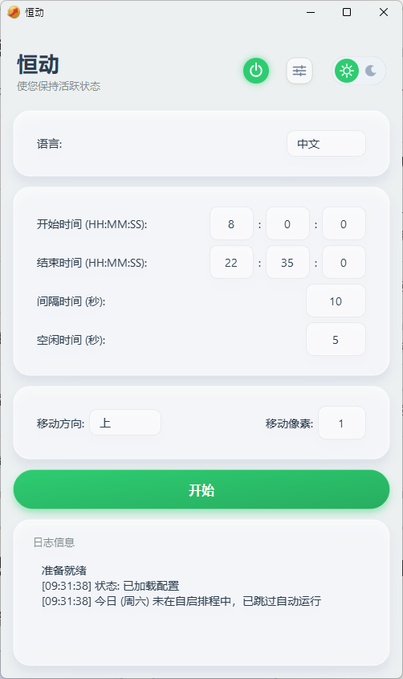

# 恒动 (Ever Pulse)

[English Document](README.md)

**v2.3**

一款现代化、高颜值的 Windows 效率工具，防止电脑进入锁屏或休眠状态。采用 **PySide6** 重构，深度打磨海军蓝极客视觉体验。



## ✨ 功能特点

- **极致 UI**: “Ever Pulse” 深海蓝极客设计，支持日/夜间模式无缝切换与水晶毛玻璃全卡片化布局。
- **开机自启与排程**: 支持原生开机自启与免点击运行，内置 7 天排程设置（非计划日自动静默退出，零后台占用）。
- **智能空闲检测**: 仅在离开电脑（空闲超过设定阈值）时自动介入模拟，不干扰正常操作。
- **精准定时调度**: 支持设置起止时间与秒级对齐，兼顾单日工作时段与跨天通宵挂机。
- **轨迹与方向定制**: 支持上下左右 4 个移动方向与像素距离自由微调。
- **双语与位置记忆**: 内置 **中文** 和 **English** 一键切换，自动记住并恢复上次窗口位置。
- **绿色便携与单实例**: 单个 EXE 绿色运行，配置自动持久化至 `config/config.ini`，多开自动唤醒已有实例。

## 🏗️ 技术架构

**Ever Pulse** 采用模块化解耦设计，确保工具的极简与高效：

- **核心引擎 (Core)**: 独立封装自动化逻辑、开机排程管理器、配置管理及多语言 (i18n) 支持。
- **异步驱动 (Worker)**: 基于 `QThread` 异步线程精准监控系统空闲，保证主界面丝滑流畅。
- **毛玻璃 UI 层**: 深度定制 PySide6 控件，利用 ARGB 实时渲染实现高级的磨砂视觉与纯矢量微标。

## 📂 项目结构

```text
ever_pulse/
├── assets/             # 静态资源（图标、语言配置文件、界面预览图）
├── config/             # 用户持久化配置（自动生成 config.ini）
├── core/               # 后端逻辑（自动化执行、开机排程管理、配置管理、多语言）
├── docs/               # 架构方案与设计文档
├── tests/              # 自动化单元测试用例
├── ui/                 # 前端组件（皮肤主题、水晶控件、主窗体逻辑与排程弹窗）
├── main.py             # 程序入口（工作目录绝对锁定与启动守门）
└── main.spec           # PyInstaller 打包配置文件
```

## 🛠️ 开发与配置

### 1. 下载与运行
从 [Releases](https://github.com/julianhopkingson/ever_pulse/releases) 页面下载最新编译好的单文件版。双击 `ever_pulse.exe` 即可启动，无需安装。  
*(注意: 如果您正在升级旧版本，请先运行 `taskkill /F /IM ever_pulse.exe` 关闭当前进程)*

### 2. 源码构建与环境搭建
如果您需要修改代码或自行编译，请参考以下步骤：

```bash
# 克隆仓库
git clone https://github.com/julianhopkingson/ever_pulse.git
cd ever_pulse

# 安装依赖
pip install -r requirements.txt

# 以开发模式运行
python main.py

# 运行自动化单元测试
python -m unittest discover tests

# 构建可执行文件 (Single EXE)
pyinstaller main.spec --clean --noconfirm
```

## ⚙️ 配置说明

> **注意**: 配置文件 `config/config.ini` 将在程序首次运行时自动生成。

- **autostart**: `True` / `False`，开机自启动开关。
- **autostart_days**: 激活的星期排程（如 `1,2,3,4,5` 表示周一至周五生效）。
- **interval**: 鼠标移动的频率（秒）。
- **activity_threshold**: 触发自动移动前需要保持静止的时长（秒）。
- **direction & pixels**: 移动方向（`Up`、`Down`、`Left`、`Right`）与移动像素。
- **auto_close_enabled**: 是否在到达结束时间后自动关闭程序。

## 📄 开源协议

本项目采用 MIT 协议开源 - 详情请参阅 [LICENSE](LICENSE) 文件。
