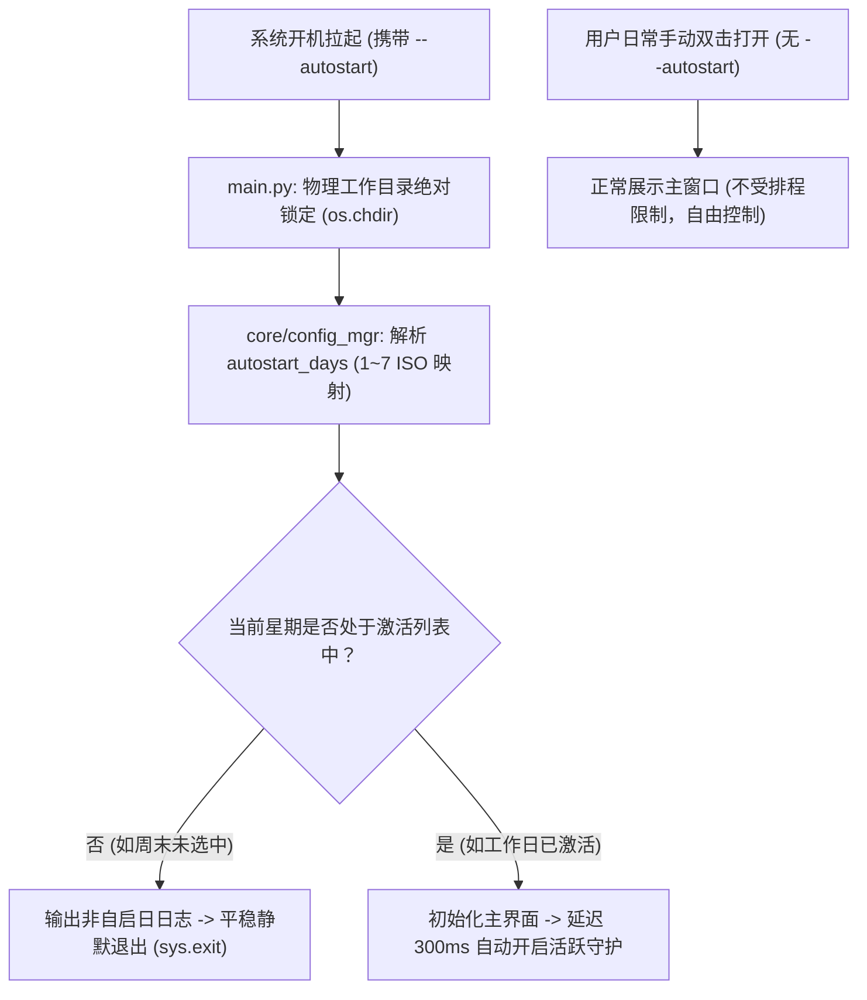

# 开机自启动周期排程与计划设置设计方案 (Autostart Schedule Enhancement)

> **文档编号**: 20260926_Design_Autostart_Schedule_Enhancement  
> **项目名称**: Ever Pulse (恒动)  
> **参考对齐基线**: [Flow Track 开机自启排程设计方案](file:///E:/workspace_antigravity/flow_track/doc/20260926_Design_Autostart_Schedule_Enhancement.md)  
> **涉及核心文件**: [ui/components/autostart_schedule_dialog.py](../ui/components/autostart_schedule_dialog.py), [core/config_mgr.py](../core/config_mgr.py), [ui/widgets.py](../ui/widgets.py), [ui/main_window.py](../ui/main_window.py), [main.py](../main.py), [assets/language.ini](../assets/language.ini)

---

## 1. 问题本质与第一性原理分析 (First Principles Analysis)

### 1.1 现状与用户痛点分析
- **周期性工作与生活节律冲突**：
  - 用户通常具有明确的工作日（如周一至周五）与休息日（如周六、周日）周期。
  - 现有的开机自启功能基于 Windows 注册表 Run 键，只要操作系统开机就会拉起程序并启动鼠标模拟。
  - 若用户在周末仅进行影音娱乐、游戏或个人事务处理，自动化模拟鼠标容易产生不必要的干扰。
- **配置粒度缺失**：
  - 缺乏按“星期”过滤的周期性计划机制，用户被迫在周末手动关闭开机自启、周一再次手动打开，操作链路冗长且容易遗忘。
- **第一性原理拆解**：
  - **调度本质**：Windows 注册表负责“物理拉起程序”，程序内部守门逻辑负责“判断今日是否为激活工作日并决定是否继续运行”。
  - **用户体验核心**：开机自启按钮旁边需要直观的入口（设置按钮），弹窗交互遵循极简原则，提供清晰的 7 天亮暗切换与快捷工作日预设。

---

## 2. 与兄弟项目 Flow Track 的血缘演进与规范对齐 (Alignment with Flow Track)

本项目（Ever Pulse）与兄弟工具项目 [Flow Track](file:///E:/workspace_antigravity/flow_track) 共享相同的底层系统级开机守护与排程治理哲学。本次设计深度吸收并对齐了 `Flow Track` 验证成熟的架构模式与 UI 交互规范：

### 2.1 100% 继承自 Flow Track 的核心资产与设计规范
1. **交互原型与弹窗架构**：
   - 严格复用 `Flow Track` 中经过实践检验的 `AutoStartScheduleDialog` 交互范式：
     - **7 天胶囊开关网格**：横向排布周一至周日（`Mon` ~ `Sun`）共 7 个状态切换按钮（`WeekDayToggleButton`）。
     - **双色状态表达**：激活态点亮为翡翠绿（`#10B981` / `#2ECC71`）加粗白字；熄灭态呈现次级暗灰（`rgba(0,0,0,0.06)` 或深色半透明暗灰）。
     - **一键快捷预设**：提供“工作日 (周一至周五)”与“每天开启”快捷文字链接。
     - **标准操作栏**：底部右对齐标准“取消”（次级灰）与“保存”（翡翠绿）操作按钮。
2. **顶栏控制组布局**：
   - 在开机自启按钮（`AutoStartIconButton`）右侧紧凑放置调音台滑块微标（`fa5s.sliders-h` 样式），共同构成直观的“自启动控制微卡片组”。
3. **工作目录 CWD 绝对锁定（根治开机路径丢失）**：
   - 继承 `Flow Track` 在 [main.py](../main.py) 最前端执行 `os.chdir(app_dir)` 锁定物理基准路径的机制，根除 Windows 登录拉起时因默认工作目录为 `C:\Windows\System32` 而导致 `config.ini` 丢失或无法写入的隐患。
4. **轻量守门决策逻辑**：
   - 继承 `--autostart` 唤醒时读取 `autostart_days` 并在入口首屏进行 `today_weekday` 比对的静默守门机制。

### 2.2 本项目（Ever Pulse）的特色本地化与水晶美学适配
- **纯矢量自绘渲染引擎**：
  - `Flow Track` 依赖外部字体库（FontAwesome `fa5s.sliders-h`）与 QSS 模板；
  - `Ever Pulse` 全面贯彻**零外部字体依赖**的轻量原则，采用 `QPainter` 纯数学矢量路径自绘调音台滑轨与滑块，确保无论在打包 EXE 还是源码环境下均具备 100% 抗锯齿高品质渲染。
- **水晶毛玻璃材质融合**：
  - 弹窗背景与容器无缝接入 `Ever Pulse` 的 `CrystalCard` 水晶卡片体系，阴影、边框与深浅色主题切换完全自动化联动。

---

## 3. 多方案评估与对比 (Multi-Option Comparison)

为了兼顾系统纯净度、跨版本兼容性与开发可维护性，我们对以下三种架构路径进行对比评估：

| 评估维度 | 方案 A：注册表拉起 + 启动时首屏星期校验 + 静默退出 (对齐 Flow Track，推荐) | 方案 B：Windows 任务计划程序 (Task Scheduler) 系统级按周触发 | 方案 C：开机全量拉起 + 始终常驻前台但保持待命挂起 |
| :--- | :--- | :--- | :--- |
| **工作原理** | 注册表携带 `--autostart` 唤醒；启动首阶段检测今日是否激活，未激活则毫秒级静默退出。 | 通过 `schtasks` 在 Windows 底层创建每周指定工作日的触发器任务。 | 开机照常拉起并显示主窗口，仅根据星期状态暂停自动移动 worker。 |
| **系统纯净度** | **高**：非工作日开机零内存占用、无窗口弹出、无后台残留。 | **高**：由系统底层决定何时拉起。 | **中**：非工作日仍占用窗口与系统内存。 |
| **权限与兼容性** | **优**：仅需 HKCU 用户态权限，无需管理员 UAC 提权，绿色免安装。 | **中**：部分企业系统限制脚本调用 Task Scheduler，且路径迁移易失效。 | **优**：无需特殊权限。 |
| **实现与维护成本** | **低且健壮**：完全复用现有成熟注册表与配置体系，逻辑高度内聚。 | **高**：涉及复杂的 XML/CLI 解析，多语言系统易出现兼容性异常。 | **低**：仅需在 Worker 状态层增加阻塞判断。 |
| **手动启动影响** | **无**：用户手动双击启动不带 `--autostart` 参数，随时可用。 | **无**：随时可手动启动。 | **一般**：非工作日手动启动也需手动恢复。 |

---

## 4. 详细技术实现路径 (Detailed Implementation Path)

### 4.1 架构流转图 (Workflow Architecture)



---

### 4.2 核心模块改造与代码设计

#### 1. 顶层入口工作目录锁定与守门退出 ([main.py](../main.py))
```python
# 确保无论开机自启还是双击启动，工作目录永久锁定至应用所在物理目录
if getattr(sys, 'frozen', False):
    app_dir = os.path.dirname(os.path.abspath(sys.executable))
else:
    app_dir = os.path.dirname(os.path.abspath(__file__))
os.chdir(app_dir)
```
当 `--autostart` 存在时，读取配置比对 `datetime.date.today().isoweekday()`，若未激活则直接安全退出。

#### 2. 配置管理器扩充 ([core/config_mgr.py](../core/config_mgr.py))
- 新增 `autostart_days` 配置项，默认值为 `"1,2,3,4,5"`（对应周一至周五）。
- 提供 `get_autostart_days() -> set[int]` 与 `set_autostart_days(days: list[int])` 解析接口。

#### 3. 矢量排程设置按钮 (`AutostartScheduleButton` in [ui/widgets.py](../ui/widgets.py))
- 规格：`36×36 px`，圆角半径 `10px`。
- 使用 `QPainter` 纯矢量绘制调音台滑块微标（三道滑轨与错落滑块），在浅色/深色主题下自适应色彩，并带有鼠标悬停微发光特效。

#### 4. 排程设置对话框 (`AutostartScheduleDialog` in `ui/components/autostart_schedule_dialog.py`)
- 尺寸：`480×270 px`，居中模态呈现。
- 内嵌 `CrystalCard` 悬浮毛玻璃主卡片与 15px 柔和立体阴影。
- 封装 7 个 `WeekDayToggleButton` 胶囊按钮（`48×34 px`），点击平滑翻转亮暗状态。
- 集成 `btn_workdays`（工作日）与 `btn_everyday`（每天）一键快捷切换。
- 底部布局标准“取消”与“保存”操作按钮。

#### 5. 多语言文案字典扩展 ([assets/language.ini](../assets/language.ini))
```ini
[中文]
tooltip_autostart_settings = 开机自启排程设置
dialog_autostart_schedule_title = 开机自启排程设置
weekday_mon = 周一
weekday_tue = 周二
weekday_wed = 周三
weekday_thu = 周四
weekday_fri = 周五
weekday_sat = 周六
weekday_sun = 周日
btn_quick_workdays = 工作日 (周一至周五)
btn_quick_everyday = 每天开启
btn_save = 保存
btn_cancel = 取消
log_autostart_skipped_today = 今日 ({}) 未在自启排程中，已跳过自动运行

[English]
tooltip_autostart_settings = Autostart Schedule Settings
dialog_autostart_schedule_title = Autostart Schedule Settings
weekday_mon = Mon
weekday_tue = Tue
weekday_wed = Wed
weekday_thu = Thu
weekday_fri = Fri
weekday_sat = Sat
weekday_sun = Sun
btn_quick_workdays = Workdays (Mon-Fri)
btn_quick_everyday = Everyday
btn_save = Save
btn_cancel = Cancel
log_autostart_skipped_today = Today ({}) is not scheduled for autostart, auto-run skipped
```

---

## 5. 涉及文件与改动职责矩阵 (File Modification Matrix)

| 目标文件 | 变更性质 | 核心职责与改动点 |
| :--- | :---: | :--- |
| `ui/components/autostart_schedule_dialog.py` | **新增** | 实现模态排程设置弹窗与 7 天星期切换胶囊组件 (`AutoStartScheduleDialog`) |
| `core/config_mgr.py` | 维护 | 扩充 `autostart_days` 配置项默认值及读写解析辅助方法 |
| `ui/widgets.py` | 维护 | 新增 `QPainter` 纯矢量调音台设置按钮 `AutostartScheduleButton` |
| `ui/main_window.py` | 维护 | 顶栏集成设置按钮，绑定排程弹窗，根据配置响应排程更新 |
| `main.py` | 维护 | 物理 CWD 绝对目录锁定，自启入口增加星期守门过滤 |
| `assets/language.ini` | 维护 | 补齐排程设置弹窗、星期缩写、快捷按钮及状态日志的多语言字典 |

---

## 6. 潜在风险评估与应对策略 (Risk Assessment)

1. **星期索引基准一致性**：
   - *潜在风险*：Python 的 `weekday()` (0~6) 与 `isoweekday()` (1~7) 容易产生 1 位偏移。
   - *应对策略*：在 UI 与数据层统一对齐 ISO 标准（1 代表周一，7 代表周日），映射关系清晰透明。
2. **便携式 EXE 物理路径自愈**：
   - *应对策略*：延续现有的 `AutoStartManager.sync_path_if_moved()` 机制，在任何一次运行中均自动修正注册表路径。
3. **全清星期的边缘处理**：
   - *应对策略*：若用户在弹窗中取消勾选了所有 7 天，保存时给出友好提醒，或同步将自启动主开关置为关闭。

---

## 7. [Mandatory Summary]

```markdown
📌 Ever Pulse 开机自启排程设置方案 (对齐 Flow Track 规范)
├── 🧬 血缘演进与对齐 (Flow Track Alignment)
│   ├── 🪟 弹窗交互 100% 对齐: AutoStartScheduleDialog (7天胶囊 + 快捷预设)
│   ├── 🔘 顶栏控制组对齐: 翡翠绿自启圆钮 + Sliders 调音台设置微标
│   ├── 🧭 路径根治对齐: main.py 绝对锁定 os.chdir(app_dir)
│   └── 🛡️ 守门逻辑对齐: --autostart 启动时根据星期静默过滤
├── 🎨 本地化水晶美学 (Ever Pulse Aesthetics)
│   ├── ✒️ 纯矢量自绘微标: QPainter 绘制调音台 (零外部字体依赖)
│   └── 💎 晶莹毛玻璃卡片: 无缝承载于 CrystalCard 体系
├── ⚙️ 核心架构与持久化 (Core Mechanics)
│   ├── 💾 配置持久化: autostart_days = 1,2,3,4,5 (默认工作日)
│   ├── 🌐 完整国际化: 中英双语 language.ini 字典扩充
│   └── 🚀 零干扰体验: 非工作日毫秒级静默退出 (sys.exit)
└── 📋 验证与闭环 (Verification Plan)
    ├── 🧹 进程清理与打包构建 (taskkill & PyInstaller)
    └── 🧪 运行与双主题切换验证 (Light/Dark Real-time Test)
```
